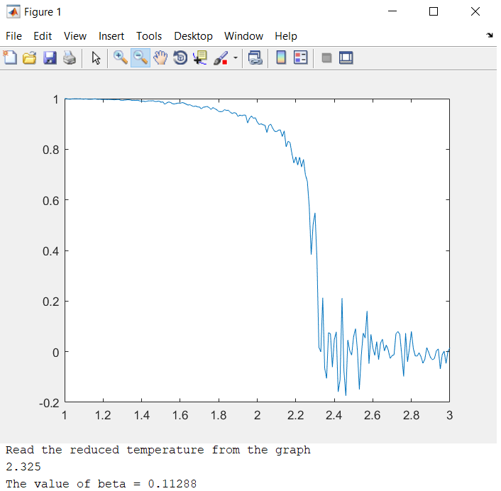
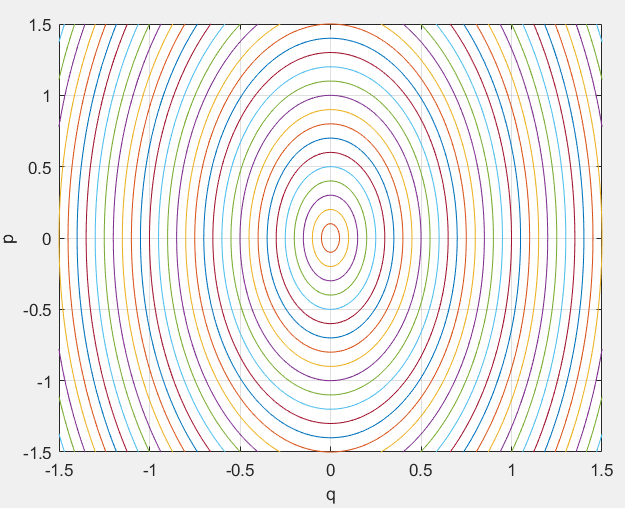
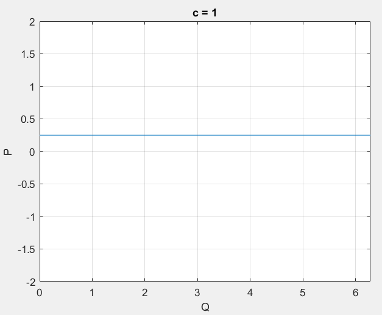

## Physics Simulations

This repository contains simulations of 3 systems in physics -
 - Plank on a Hemisphere - Classical Mechanics
 - Ising Spin - Statistical Mechanics
 - Canonical Transformations - Classical Mechanics

### 1. Plank on a Hemisphere

My interest into this system arose after an elusive problem in the final exam of the Classical Mechanics course at BITS. Derivation of the equations of motion can be found in [this](Plank-on-Hemisphere/Plank-on-Hemisphere.png) file.

### 2. Ising Spin

This is a model of ferromagnetism at very low temperatures where a 2nd order phase transition is observed at above a critical temperature. Please refer to the [wiki](https://en.wikipedia.org/wiki/Ising_model) article for theoretical details.

In the above figure, a clear dip in the system energy can be found around `T=2.3`. This is the aforemention phase transition.

### 3. Canonical Transformations

The harmonic oscillator has an elliptic phase space trajectory. The canonical transformations (CT) are a set of transformations from the standard generalised co-ordinates to action-angle variables where the phase space trajectory is a re-injected flatline. This only occurs for `c=1` (*a transformation variable*). The codes explore the oscillator phase trajectories for a range of values `c<1` and `c>1` which still result in a valid transformation.

Here is the CT transformed phase trajectory for `c=1`

Please refer to the [writeup](Canonical-Transformation/CT.pdf) for a discussion and plots of the CT for other values of `c`.
